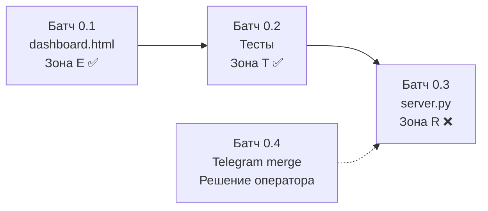

# Волна 0 — Дашборд не врёт, 4 живых API, контракт UI↔маршрут

## Контекст

Исследование (субагент + скриншоты) показало:

| Компонент | Факт |
|---|---|
| `Eye/dashboard.html` | 6 из 7 вкладок показывают **100% захардкоженные данные**: тесты `26/26`, `30/30`, `32/32`, версия `v6.105.1`, все чекбоксы `checked disabled` |
| `Core/server.py` | `/api/status` возвращает `"verified_tests": "32/32 PASS"` — литерал. Реально тестов 178, не 32 |
| Коннекторы | `github_connector.py` и `postgres_connector.py` — **100% заглушки** (ни одного сетевого вызова). `telegram_connector.py` — реальный I/O |
| Telegram-ветка | 11 коммитов, 178/178 тестов, **0 конфликтов с main**, PR не открыт |

> [!IMPORTANT]
> Зональное ограничение: `Eye/` = зона E (автономно), `Core/` и `Tool/connectors/` = зона R (нужен оператор), `tests/` = зона T (автономно, но **отдельным коммитом** от не-T).

---

## Батч 0.1 — Дашборд перестаёт врать (зона E, автономно)

### [MODIFY] [dashboard.html](file:///C:/Users/Huawei/source/Why_Ai/Eye/dashboard.html)

**Принцип: заменить статику на `fetch()` к уже существующим маршрутам `server.py`, не создавая новых.**

1. **Шапка / статус-бар:**
   - Убрать захардкоженные `✓ 26/26 Tests PASS`, `v6.105.1`, `● Supervisor Active`
   - Добавить `fetch('/api/status')` при загрузке → отобразить реальные `version`, `supervisor_status`
   - Добавить `fetch('/api/tests')` по кнопке → показать фактическое число тестов из `stdout`

2. **Вкладка 3 «Живой чек-лист»:**
   - Убрать все `checked disabled` чекбоксы из HTML
   - Добавить `fetch('/api/config')` → вычислять статус задач из реального конфига
   - Fallback при недоступном бэкенде: явный баннер «Бэкенд недоступен», а не фейковые галочки

3. **Вкладка «Swarm» (уже частично живая):**
   - Убрать захардкоженный блок Root Orchestrator `RUNNING` (строки 997–1011)
   - Отображать только то, что вернул `/api/swarm/tasks`

4. **Auto-Replay (`startEvolutionReplay`):**
   - Убрать `alert('🏁 ... 32/32 тестов PASS!')` — он врёт
   - Заменить на вызов `/api/tests` и показ реального результата

5. **Локальный fallback (строки 1560–1565):**
   - При `file:///` протоколе — баннер «Откройте через сервер: python Core/server.py», а не фейковые данные

> [!WARNING]
> **НЕ трогаю:**
> - Вкладку 1 «Архитектурная топология» — это справочник, не телеметрия; статика оправдана
> - Вкладку 6 «Обоснования» — это документация, не данные
> - Вкладку 2 «Дорожная карта» — карточки фаз отражают проектное решение; их «100%» уже исправлено в `roadmap.md` (PR #4), дашбордная копия подтянется вслед

---

## Батч 0.2 — Тесты для UI-контракта (зона T, отдельный коммит)

### [NEW] [test_dashboard_contract.py](file:///C:/Users/Huawei/source/Why_Ai/tests/test_dashboard_contract.py)

Контрактные тесты, которые запускают `Core/server.py` в subprocess и проверяют API-ответы, от которых теперь зависит дашборд:

1. `test_api_status_returns_real_fields` — `/api/status` содержит ключи `version`, `supervisor_status`, `timestamp`
2. `test_api_status_no_hardcoded_test_count` — значение `verified_tests` НЕ содержит литерал `"32/32"` (падающий тест до фикса в Батч 0.3)
3. `test_api_tests_runs_real_suite` — `/api/tests` возвращает `returncode`, `stdout` с `Ran \d+ tests`
4. `test_api_swarm_tasks_returns_list` — `/api/swarm/tasks` возвращает JSON с ключом `children`
5. `test_api_config_parses_yaml` — `/api/config` возвращает словарь с `system`

> [!IMPORTANT]
> `test_api_status_no_hardcoded_test_count` — **намеренно падающий** до Батч 0.3 (фикс в `Core/server.py`). Это доказательство, что тест ловит проблему. Вывод падения будет записан.

---

## Батч 0.3 — Фикс серверных литералов (зона R — нужен оператор)

### [MODIFY] [server.py](file:///C:/Users/Huawei/source/Why_Ai/Core/server.py)

`/api/status` строки 120–124 — заменить литералы на вычисляемые значения:

```diff
- "verified_tests": "32/32 PASS",
- "active_invariants": "13/13 BIBLE.md",
+ "verified_tests": self._count_tests(),
+ "active_invariants": self._count_invariants(),
```

Где `_count_tests()` запускает `python -m unittest discover` (аналог `/api/tests`) и парсит `Ran N tests`, а `_count_invariants()` считает принципы в `BIBLE.md` (15, не 13).

> [!CAUTION]
> Это зона R. Я **не могу** коммитить это автономно. Варианты:
> 1. Я готовлю дифф, вы ревьюите и коммитите (аналог PR #3)
> 2. Вы правите вручную, я проверяю тестами

---

## Батч 0.4 — Telegram-ветка → main (решение оператора)

Ветка `agent/sonnet5/telegram-bridge`:
- 11 коммитов (TASK-TG-07..12)
- 178/178 тестов зелёные
- 0 конфликтов с `main` по `git merge-tree`
- **Содержимое:** реальный SSE-подписчик, long polling, диспетчер `/panic` и `/status`
- **Зоны затрагивает:** `Tool/connectors/` (R), `Core/server.py` (R), `tests/` (T)

> [!IMPORTANT]
> Решение за вами:
> - **Ребейзить на `main` и открыть PR?** (я сделаю ребейз и классификацию)
> - **Смержить as-is?** (0 конфликтов, но docs/ дифф будет шумный из-за старого merge-base)
> - **Отложить до после Волны 0?**

---

## Контракт UI↔маршрут (результат Волны 0)

| Элемент UI | API endpoint | Формат ответа | Поведение при ошибке |
|---|---|---|---|
| Статус-бар | `GET /api/status` | `{version, supervisor_status, timestamp}` | Показать «Бэкенд недоступен» |
| Число тестов | `GET /api/tests` | `{status, returncode, stdout}` | Показать «—» |
| Чек-лист | `GET /api/config` | `{system: {active_mode, ...}}` | Скрыть секцию |
| Дерево роя | `GET /api/swarm/tasks` | `{id, role, status, children}` | Пустое дерево |
| Идентичность | `GET /api/identity` | `{identity, scratchpad}` | Показать fallback |
| Live-события | `GET /api/events/stream` (SSE) | `event: type\ndata: json` | Переподключение с backoff |
| Кнопка Panic | `POST /api/panic` | `{status: "PANIC_STOPPED"}` | **Явное сообщение об ОТКАЗЕ** |

---

## Порядок выполнения



**Батчи 0.1 и 0.2** — делаю автономно, двумя отдельными коммитами.
**Батч 0.3** — требует вашего ревью (зона R).
**Батч 0.4** — ваше решение по telegram-ветке.

## Open Questions

1. **Вкладка 2 «Дорожная карта»** в дашборде всё ещё говорит «100% Фаза 1/2/3». Править ли её сейчас (чтобы совпадала с исправленным `roadmap.md`) или это отдельный батч?
2. **`_count_tests()` в `/api/status`** — запускать тесты при каждом вызове статуса дорого. Альтернатива: кешировать результат последнего прогона. Что предпочтительнее?
3. **Telegram-ветка** — ребейзить, мержить, или отложить?
